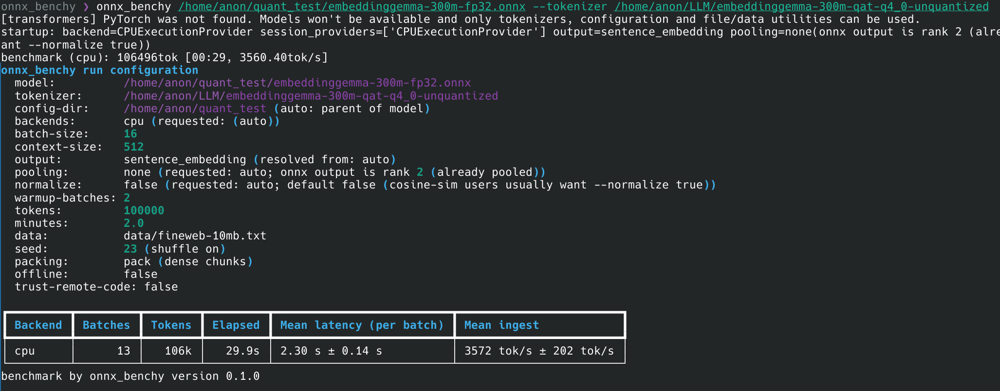

# onnx_benchy

onnx_benchy measures how fast an ONNX text-embedding model runs

```bash
onnx_benchy model.onnx --tokenizer BAAI/bge-small-en-v1.5
onnx_benchy model.onnx --tokenizer ./my-tokenizer/ --cuda --cpu \
  --batch-size 16 --context-size 512 --tokens 500000 --minutes 2
```



## Install

```bash
pip install onnx-benchy            # CPU build
pip install "onnx-benchy[cuda]"    # GPU build, in a separate venv
```

From source, for development:

```bash
git clone https://github.com/electroglyph/onnx_benchy
cd onnx_benchy
pip install -e .          # CPU build
pip install -e ".[cuda]"  # GPU build, in a separate venv
```

## Options

### Model and tokenizer

- `model` — path to the `.onnx` file.
- `--tokenizer` (required) — local directory or Hugging Face id, e.g.
  `./tok/` or `BAAI/bge-small-en-v1.5`. An ONNX file doesn't include a
  tokenizer, so there is no default here.
- `--config-dir` — directory with `modules.json` and `*Pooling/config.json`,
  used to detect pooling and normalization settings. Default: the folder the
  model file is in.
- `--list-outputs` — print the model's output names, shapes, and dtypes, then
  exit. Handy for figuring out what `--output` should point at.

### Backends

One flag per backend: `--cpu`, `--cuda`, `--tensorrt`, `--rocm`,
`--migraphx`, `--openvino`, `--coreml`, `--directml`, `--qnn`.

- If you pass none of them, every supported backend available on the machine
  is benchmarked.

### Batch shape

- `--batch-size` (default `16`) — sequences per inference request. Latency
  is reported per document (batch time divided by batch size), so it's
  comparable across batch sizes.
- `--context-size` (default `512`, also spelled `--seq-len` or
  `--max-length`) — tokens per sequence. Long documents are split, short ones
  padded. If it's larger than the tokenizer's own limit, it's clamped down
  with a warning.
- `--output` (default `auto`) — which model output to embed. `auto` prefers
  `sentence_embedding`, then `last_hidden_state`, then `token_embeddings`,
  then the first output. You can also pass an index (`--output 1`) or an
  exact name.
- `--pooling` (default `auto`) — `cls`, `mean`, `max`, `lasttoken` (`last`
  works too), or `none`.
- `--normalize` (default `auto`) — `true` or `false`, whether to L2-normalize
  the embeddings. `auto` turns it on when the config has a Normalize module,
  off otherwise.
- `--warmup-batches` (default `2`) — untimed batches run before measuring.

### How long to run

- `--tokens` — stop after this many input tokens.
- `--minutes` — stop after this many minutes, warmup and tokenization aren't included.

Whichever limit hits first stops the run, and it's checked after every batch.

### Data and misc

- `--data` (default `data/fineweb-10mb.txt`) — text file to benchmark on.
- `--seed` (default `23`) — bleh.
- `--no-shuffle` — keep the file's line order instead.
- `--no-pack` — by default, all text is concatenated and sliced into full
  `context-size` blocks, so every batch is dense and the tok/s numbers are
  honest. `--no-pack` goes back to one document per sequence with
  truncate-and-pad, which keeps document boundaries intact at the cost of some
  padding.
- `--offline` — self-explanatory.
- `--trust-remote-code` — pass `trust_remote_code=True` when loading the
  tokenizer. Off by default; only enable it for tokenizers you trust.
- `--output-format` (default `table`) — `table`, `json`, or `csv`.
- `--output-file` — also write the report to this file.
- `--no-progress` — hide the progress bars. `-q`/`--quiet` does the same but
  also quiets per-batch chatter; the config block, results, and version line
  always print either way. `-v`/`--verbose` adds extra detail.

## Results

- `Mean latency (per doc)` — average time per document/sequence: each timed
  batch's wall time divided by `--batch-size`, then averaged over batches
  (std, and `p50`/`p95` in `json`, come from the same per-doc samples).
- `Mean ingest` — tokens/sec, averaged over batches from non-pad tokens
  (attention-mask sum) only.
- `Batches` / `Tokens` / `Elapsed` — totals for the timed loop (warmup and
  tokenization excluded).

With default packing, a "document" is one dense `context-size` chunk sliced
from the concatenated corpus; with `--no-pack` it's one source line per
sequence (truncate-and-pad).

## Benchmark text

`data/fineweb-10mb.txt` is ~10 MB of data taken from `HuggingFaceFW/fineweb`,
config `sample-10BT` (license: ODC-By).
To regenerate it:

```bash
python scripts/fetch_fineweb.py
```

Provenance (source revision, sizes, hash) lives in
`data/fineweb-10mb.meta.json`.
